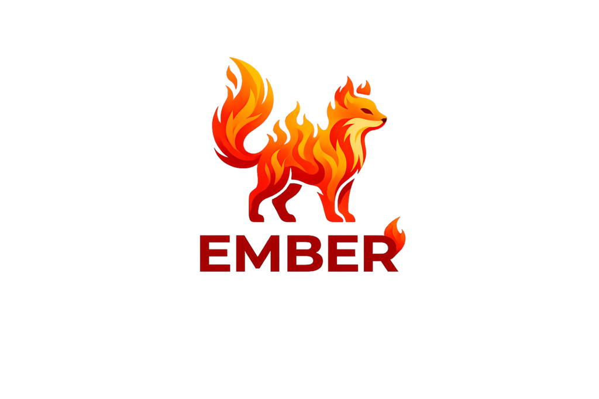
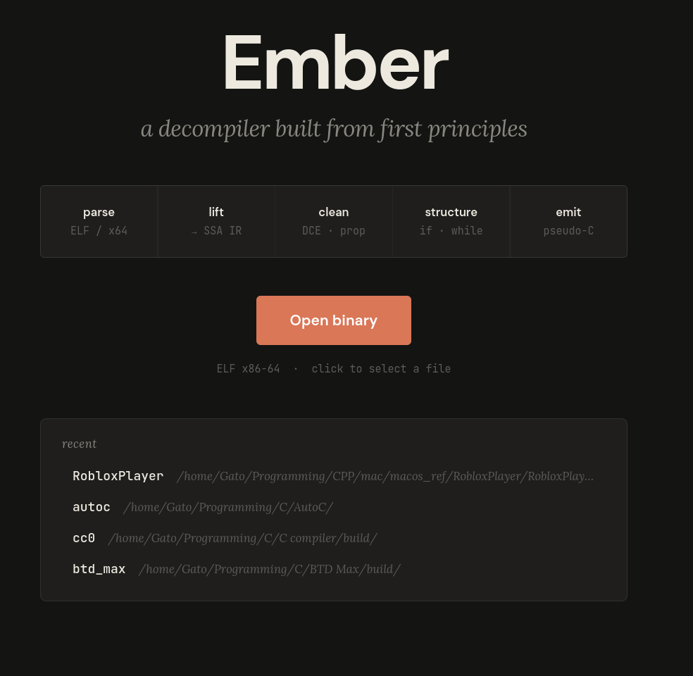
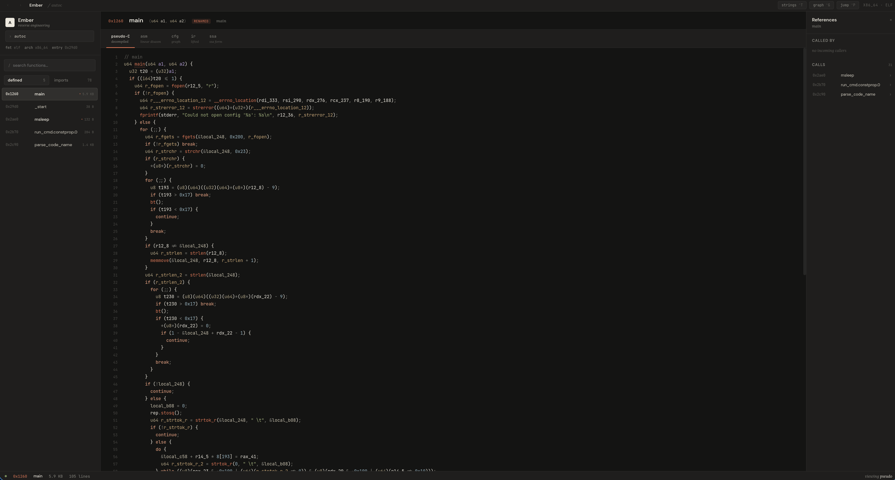

<p align="center">
  
</p>

<h1 align="center">Ember</h1>

<p align="center">
  <a href="https://github.com/FlavouredTux/Ember/actions/workflows/ci.yml">
    
  </a>
  
  
  
</p>

A from-scratch reverse-engineering toolkit. ELF + Mach-O + PE loaders,
Microsoft minidump + raw-region memory image loaders, an x86-64
decoder/lifter/SSA pipeline, structurer, pseudo-C emitter, a
declarative annotation/scripting format, and an Electron UI.

**No Capstone. No Zydis. No Ghidra. No LLVM. No vendored deps.** Stdlib
only.




---

## What's in the box

| Area | x86-64 ELF | x86-64 Mach-O | x86-64 PE / minidump | AArch64 ELF / Mach-O | PPC64 ELF |
|---|---|---|---|---|---|
| Loader            | ✅          | ✅          | ✅ + dumps  | ✅          | ✅ |
| Decoder + IR lift | ✅          | ✅          | ✅          | partial     | partial |
| SSA + cleanup     | ✅          | ✅          | ✅          | partial     | — |
| Pseudo-C output   | ✅          | ✅          | ✅          | partial     | — |
| ABI modeling      | SysV        | SysV        | Win64       | AAPCS64     | ELFv1/v2 |
| Imports/exports   | PLT/GOT     | LC dyld     | IAT + delay | PLT/LC dyld | — |
| Symbols recovery  | dynsym      | LC_SYMTAB   | export dir + PDATA + PDB | dynsym / LC_SYMTAB | dynsym |
| Unwind info       | eh_frame    | LSDA pads   | UNWIND_INFO | eh_frame    | — |
| RTTI              | Itanium     | Itanium     | MSVC        | Itanium     | — |
| Demangle          | Itanium     | Itanium     | MSVC partial | Itanium    | — |
| Indirect calls    | IAT + vtable* | IAT + vtable* | IAT + vtable* | vtable*  | — |
| Switch idioms     | 5 patterns  | 5 patterns  | 5 patterns (incl. MSVC two-table) | inherits the analyzer | — |

<sub>* `--resolve-calls` is opt-in; fires on constant vtables today.
Receiver-typed dispatch is gated on the IPA work in progress.</sub>

## Build

C++23 compiler (gcc 15+ or recent Clang) and CMake 3.28+.

```sh
cmake -S . -B build -DCMAKE_BUILD_TYPE=Release
cmake --build build -j
./build/cli/ember --help
```

### UI

```sh
cd ui && npm install && npm run dev
```

Set `EMBER_BIN` if the CLI isn't at `../build/cli/ember`.

## CLI

```
ember [options] <binary>

  -d, --disasm           linear disassembly of a function
  -c, --cfg              control-flow graph
  -i, --ir               lifted IR
      --ssa              IR in SSA form (implies -i)
  -O, --opt              run cleanup passes (implies --ssa)
      --struct           structured regions (implies -O)
  -p, --pseudo           pseudo-C output (implies --struct)

  -X, --xrefs            full call graph
      --strings          dump printable strings
      --arities          dump inferred arity per function
      --functions [P]    list every discovered function (TSV)
      --fingerprints     content-hash per function (cross-version matching)
      --validate NAME    where does NAME live + similar lookalikes
      --collisions       names / fingerprints bound to >1 address

      --ipa              run IPA before pseudo-C (typed sigs across calls)
      --resolve-calls    resolve indirect calls (IAT + constant vtables)
      --eh               parse unwind tables, mark landing pads

  -s, --symbol NAME      target a specific symbol (default: main)
      --annotations P    user renames / signatures sidecar file
      --apply PATH       apply a .ember declarative script (renames, sigs,
                         notes, pattern-renames, log-format-driven renames,
                         deletes) to the resolved annotation file
      --dry-run          with --apply: don't write; dump the would-be TSV

      --regions PATH     load via raw-region manifest (Scylla-style scrape)
      --apply-patches F  apply (vaddr_hex, bytes_hex) patches to the binary
      --cache-dir DIR    override ~/.cache/ember
      --no-cache         bypass the on-disk cache
```

Heavyweight passes (`--xrefs`, `--strings`, `--arities`, `--fingerprints`)
cache to `~/.cache/ember/`, keyed on `path | size | mtime | version`.
First run is slow, subsequent runs are instant.

## Pipeline

```
binary  →  loader (ELF / Mach-O / PE / minidump / regions)
        →  decoder
        →  CFG
        →  IR lift (x64 / PPC64)
        →  SSA
        →  cleanup (const-fold, copy-prop, GVN, store→load forwarding, DSE)
        →  local type inference   ─┐
        →  IPA (typed signatures) ─┴─ optional, opt-in
        →  frame layout (typed stack locals; PDB names when a sidecar's attached)
        →  structurer (if / while / for / switch / goto fallback)
        →  pseudo-C emitter
```

x86-64 has the full pipeline. AArch64 (ARMv8-A) covers a large slice of
the integer/branch/load-store instruction set — enough to load, decode,
build CFGs, and lift basic ALU/memory bodies into pseudo-C; the
floating-point + Advanced SIMD families are decoded shape-only and lift
as named intrinsics. PPC64 currently supports loading, metadata,
disassembly, and CFG-oriented browsing.

## Windows runtime images

For packed / protected targets where the on-disk PE is a stub, point
Ember at a runtime memory image instead:

```sh
# A Microsoft minidump (.dmp). procdump, taskmgr, WinDbg can produce these.
ember -p ./crash.dmp

# Or a hand-rolled scrape: a manifest of (vaddr, size, flags, file) lines
# pointing at .bin region dumps.
ember --regions ./scrape/regions.txt -p
```

The minidump loader pulls per-module symbols from each module's
in-memory PE headers, so imports and exports get named even when the
on-disk image was junk. Module-name collisions get prefixed:
`kernel32!CreateFileA`.

## Scripting

Ember's scripting surface is a declarative `.ember` format consumed by
`--apply`. Section-keyed, no expressions or control flow — every line
is a single `key = value` (or `pattern -> template`) pair. Drives bulk
renames, signature batches, log-format-string-to-rename inference, and
pattern globs over the discovered function set, all into the same
`Annotations` file emit reads back at decompile time.

```sh
ember --apply project.ember <binary>            # writes through to annotations
ember --apply project.ember --dry-run <binary>  # preview as TSV on stdout
```

A small example:

```ember
[rename]
0x401234 = do_thing
log_handler = handle_log_line

[signature]
0x401234 = int do_thing(char* name, int x)

[from-strings]
"[HttpClient] %s" -> HttpClient_$1
```

Full surface in [docs/scripting.md](docs/scripting.md).

## Plugin platform

A plugin ecosystem aimed at target-specific reversing — games, engines,
protocols, build-to-build knowledge carryover — is layered onto the
Electron UI side, not the C++ core. Plugins are `.cjs` bundles
(`plugin.json` + `main.cjs`) loaded by the renderer's Node runtime; the
core surface they consume is the same `Annotations` API the `.ember`
format drives. Design in [docs/plugin-platform.md](docs/plugin-platform.md).

## Layout

```
core/             C++23 library — everything except the CLI shim
  include/ember/  public headers
  src/
    binary/       ELF + Mach-O + PE + minidump + raw-regions + PDB v7
    disasm/       x86-64 + AArch64 + PPC64 instruction decoders
    analysis/     CFG, arity, strings, xrefs, sig inference (IPA),
                  type inference, indirect-call resolver, MSVC + Itanium
                  RTTI, eh_frame, PE UNWIND_INFO, ObjC, fingerprints
    ir/           IR + lifters + SSA + cleanup passes + type lattice
    structure/    region builder (if/while/for/switch/goto)
    decompile/    pseudo-C emitter
    script/       declarative .ember parser + applier
    common/       annotations, on-disk cache
cli/              command-line driver
ui/               Electron + React + TypeScript frontend
tests/            golden-output CTest suite
docs/             scripting, plugin platform, mascot, screenshots
```

## Tests

```sh
cmake --build build -j
ctest --test-dir build
```

Fixtures are small C programs compiled at build time, plus hand-built
ELF/Mach-O/PE/minidump generators in `tests/fixtures/` so CI runs on
Linux without needing macOS / Windows toolchains. Output is diffed
against checked-in goldens in `tests/golden/`. To accept an
intentional change:

```sh
UPDATE_GOLDEN=1 ctest --test-dir build -V
```

CI runs in a `gcc:15` container so goldens are toolchain-stable.

## Status

Active. The pipeline is solid enough to beat hand-reading x86-64 on
real binaries; pseudo-C output is generally readable and improves
visibly with `--ipa --resolve-calls --eh` on. Known rough edges
(intentionally documented):

- Indirect calls without IAT or constant-vtable shape still render as
  `(*(u64*)0x...)(...)`. Receiver-typed dispatch needs the in-progress
  IPA work to flow class types into call sites.
- Sub-register arithmetic corners can look clunky.
- Switch cases whose default falls outside the bounds check can
  misattribute.
- AArch64 floating-point and Advanced SIMD are decoded shape-only and
  lift as `arm64.<op>(...)` intrinsics. SVE / SME unmapped.

## License

MIT. See [LICENSE](LICENSE).
